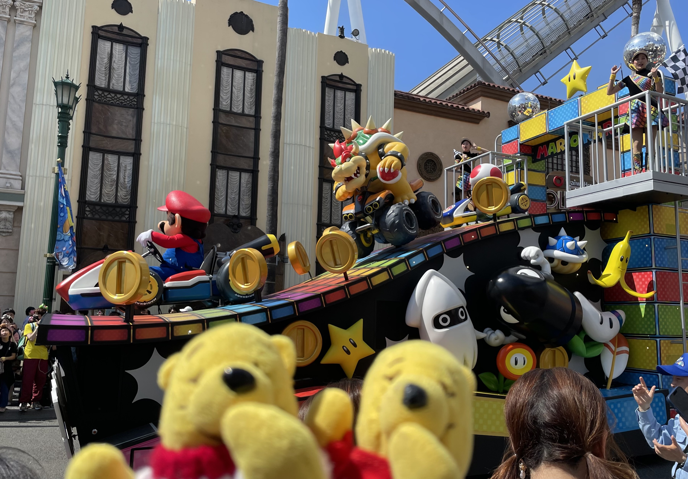
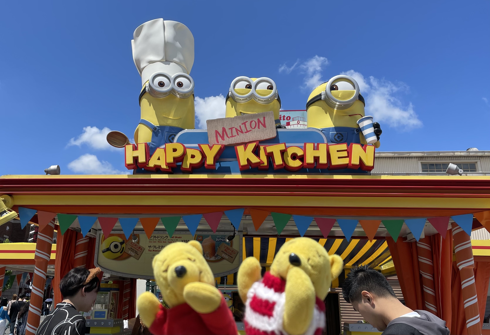
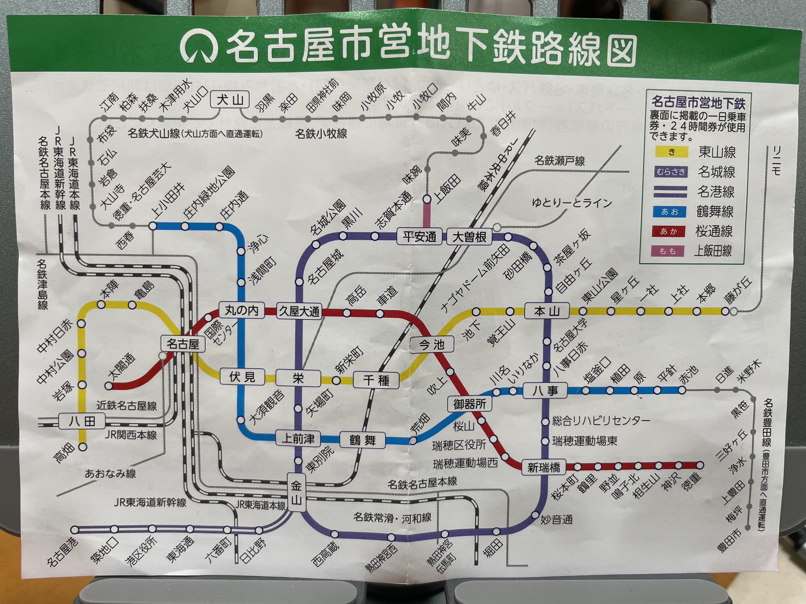
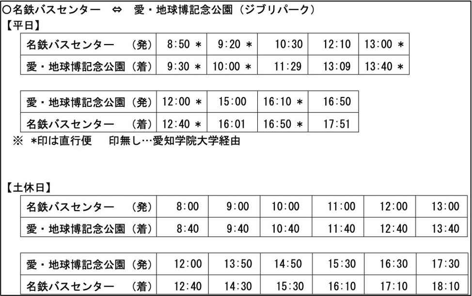

自從畢業以及疫情後，已經3年多沒有出國了。看著IG上，朋友們一個個的出國旅遊，心裡好羨慕啊。終於這次趁出國唸書之前，和家人也一起出國囉！

記得上次去日本大約是快十年前，剛要升高中的時候去的大阪...
時間真的過得飛快。

由於看到環球影城有新的瑪利歐世界，因為很喜歡瑪利歐相關的遊戲（瑪利歐、瑪利歐派對、瑪利歐賽車等等），
於是當然想看看實際去到瑪利歐世界會是怎麼樣子囉！

▲Mario Parade 

▲Lovely Minion 

如果有興趣看到更多的旅遊照片，可以到[Pooh.travel.blog笑咪咪Pooh的旅遊日記](https://instagram.com/pooh.travel.blog?igshid=MjEwN2IyYWYwYw==)觀看！

ps 我最喜歡的角色是耀西和害羞幽靈

## 5/14-5/22的行程

由於不想再回到原點，所以搭飛機由大阪進、名古屋出。
因此，我們選擇了5/14桃園機場至大阪的長榮航空，
以及5/22早上從名古屋回桃園機場的華航。
先放上一張總覽圖：

由於主要大阪部分的其他景點以前都去過了，所以只有安排環球影城(主要想去馬力歐樂園)和購物，建議如果第一次來大阪，其實是可以停留4-5天漫遊。

現在日幣貶值，加上信用卡回饋，買Uniqlo真的就跟台灣價格打75折差不多！
DHC藍莓精華和合力他命的價差也很大，DHC藍莓精華在台灣買大概500-600不等，在那邊的藥妝店比價，平均大概300台幣左右，如果平常會常吃這些保健食品的話，真的很推薦在日本大買特買。

### -
## 關於交通
這趟旅行的交通部分，主要先訂好票的有關西機場至大阪市區的特快車、大阪至名古屋的JR車票、大阪地鐵巴士一日乘車券。

另外，有在名古屋車地鐵站，購買一日的地鐵票。

### 1.關西機場至大阪市區
由於到大阪已經5點多，出關的時候人滿多的，所以當天晚上就直接到環球影城飯店入住，等待隔天早上直接開始玩。
從大阪關西機場至大阪車站，我們是直接至Klook買。
#### 訂票方式
>[關西樂享周遊券（3項設施）+ 關空特快 HARUKA 車票（關西機場→新大阪／天王寺站）](https://www.google.com)，除了有從關西機場至市區（可選擇至天王寺、大阪或新大阪車站）外，亦有關西樂享周遊券（3項設施）券可以使用（不過這部分後來因為時間的關係，所以我們也沒有使用到）

ps.購買此票券的時候，klook會有說明如何取票，如果是在關西機場的話，出來之後左轉直直走，接著上二樓到另一棟樓的搭車處的取票機取票，在刷卡進入站前，可以看到班次表。

### 2.大阪至名古屋
大阪至名古屋的交通，我們選擇搭乘JR：新大阪到名古屋車站，車程大約50分鐘，售價折合台幣約1500多(匯率1:4左右)。

#### 訂票方式
>1. [官網訂票：](https://www.westjr.co.jp/global/tc/ticket/overview/)
雖然不是中文的，但是按照上面的步驟和翻譯，一步一步的點擊購買，另外，可以選擇適合放置大行李的位子，一個月前就開放可以訂票了。
>2. [Klook訂票：](https://s.klook.com/c/93aaJ_Ne3a)
Klook真的非常方便，涵蓋旅遊行程、住宿、交通、租車，都可以預訂。當然，JR車票也可以在上面預定囉～！不過，雖然方便，但每張票都要收額外的台幣300元手續費，看到的當下，立馬關掉去訂官網。

### 3.大阪地鐵票
大阪有one-day和two-day地鐵巴士乘車券，這部分也可以在klook上先訂票。
#### 訂票方式
>[大阪地鐵巴士乘車券(1日/2日)](https://s.klook.com/c/VX5N0B58XD)

### 4.名古屋地鐵票
名古屋地鐵票，是在地鐵站內至詢問處購買的，同時也拿了一張捷運路線圖（也可以拍下來用手機看）

▲One day pass in Nagoya

▲subway in Nagoya

▲每週六日及每月8號，購買使用一日乘車券是比較便宜的：大人620日圓、小孩310日圓；剛好我們購買使用那天是星期六XD

### 5.名古屋巴士站-愛·地球博紀念公園車站（吉卜力公園)

從名古屋-吉卜力公園，除了搭地鐵外，也可以搭乘巴士，地鐵的價格比巴士便宜一些，但搭乘巴士的話，車程大概35分鐘左右就到了。

搭乘巴士的位置在[名鐵巴士中心](https://maps.app.goo.gl/MZ58oczd85LArTXe6?g_st=ic)的四樓24號，可以上車之後再買付款（一人1000日圓）

回程在愛·地球博紀念公園車站的3號車牌，就可以搭乘回名鐵巴士中心了。

▲班次表

▲地圖相對位置
