## 關於訂票
### 吉卜力公園門票
2022年11月1日才開幕的吉卜力公園，目前只開放開個部分：大倉庫、青春之丘、DONDOKO之森。本來想使用官網訂票，但發現好像需要有日本的手機號碼還是相關的認證（有點忘記是什麼），所以後來是在蝦皮代購（可以至上面搜尋吉卜力公園），請人幫忙買票券。價格和官網上的沒有差到很多。但因為只有提前一個多月購買，所以只有買到大倉庫門票。

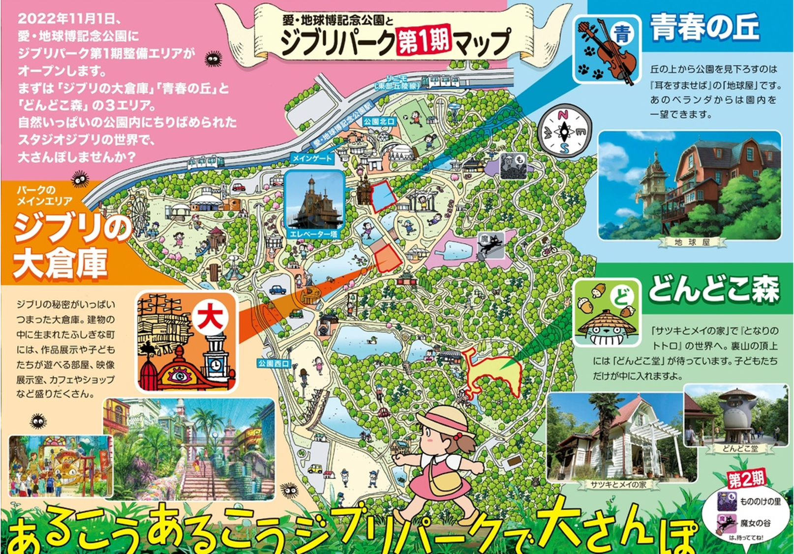
#### [官方網站](https://l-tike.com/bw-ticket/ghibli/ghibli-park/)

##### 1.吉卜力大倉庫
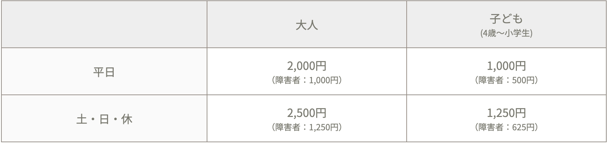

##### 2.青春之丘和吉卜力大倉庫門票
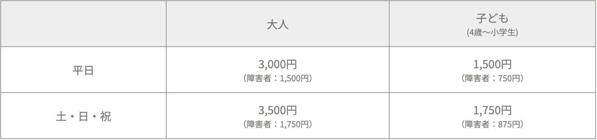

##### 3.DONDOKO之森
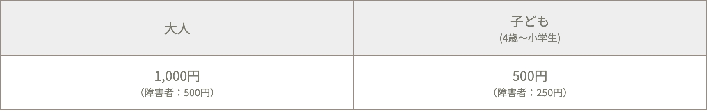
### -
## 關於黑部立山三日遊
由於四月初準備預定行程時，手邊比較多忙的事情，所以是選擇KKday三天兩夜的白川鄉/高山陣屋、黑部立山、上高地/河童橋遊，包含當中的吃飯及住宿。雖然跟著遊覽車很方便，不過由於習歡自助，所以還是不太習慣跟團....，到每個景點都在趕趕趕和集合，後來發現其實去黑部立山的交通，也可以規劃坐巴士等等，而且費用也便宜很多很多，也不用一直在坐遊覽車以及一直等集合。

##### [購票平台：KKday](https://www.kkday.com/zh-tw)

| Photos          |
| ------------- |:-------------:|
| 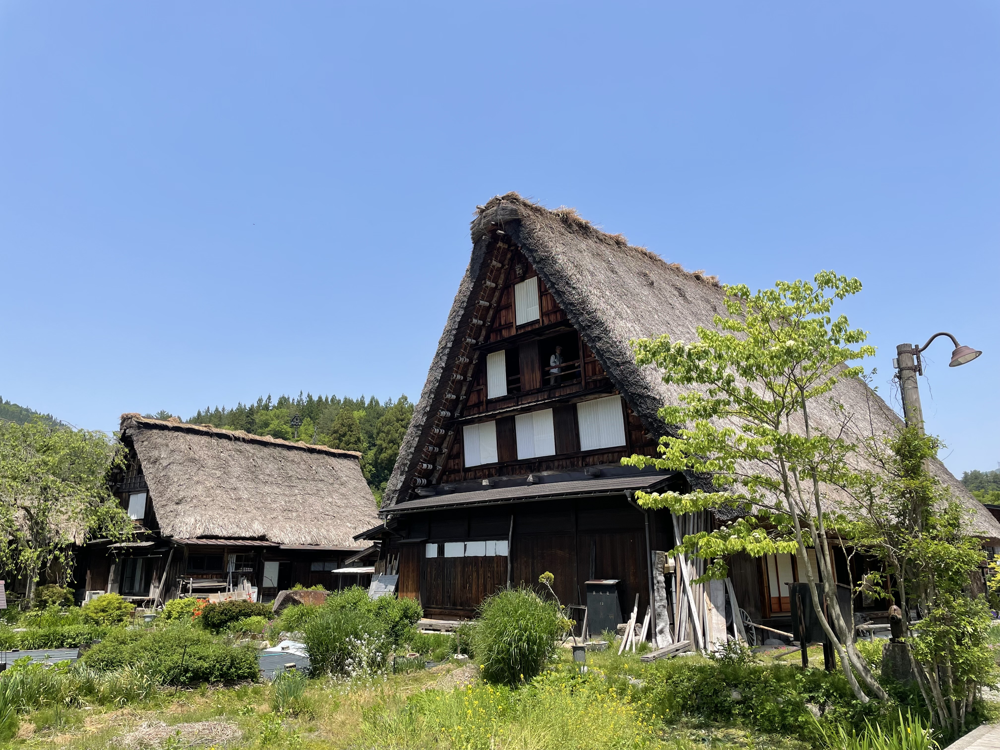| 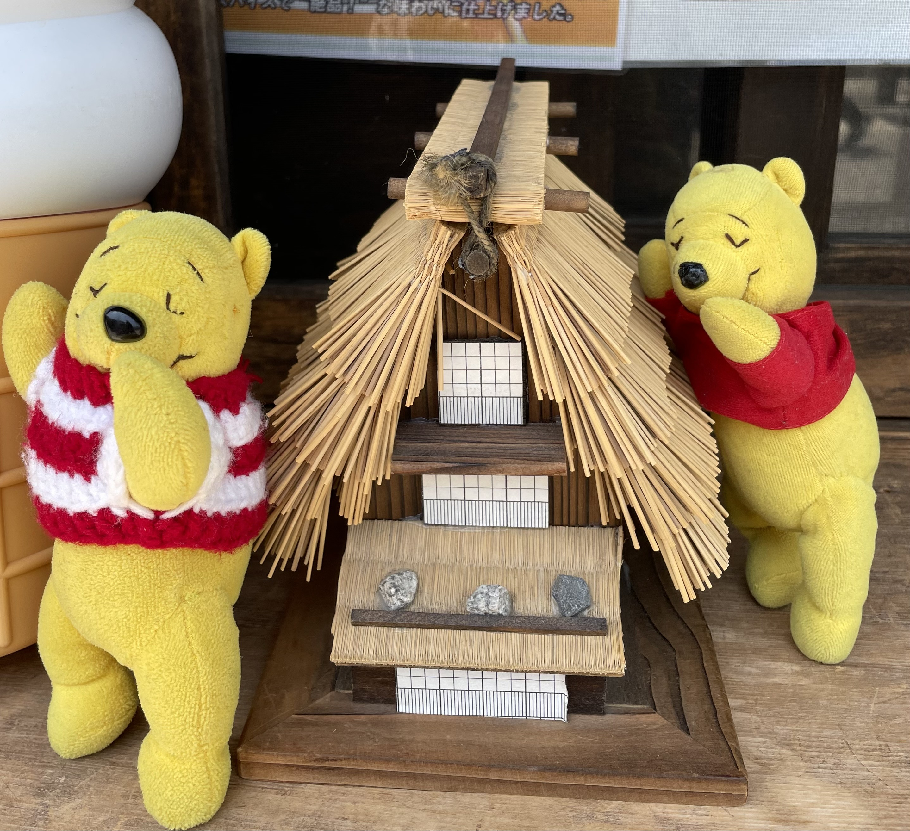 | 
|合掌村，5/17到訪天氣超熱|維尼們與mini合掌村|
| 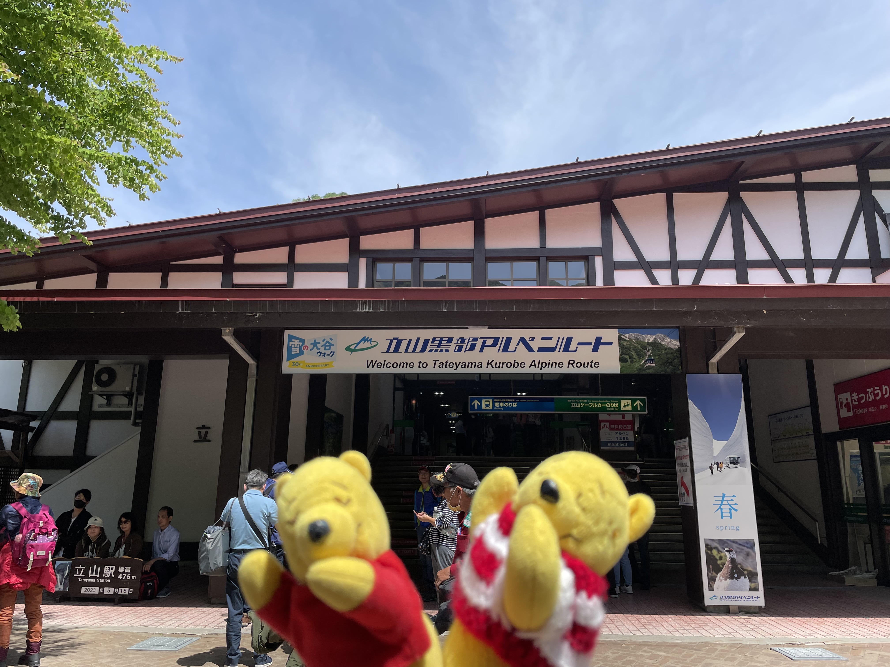| 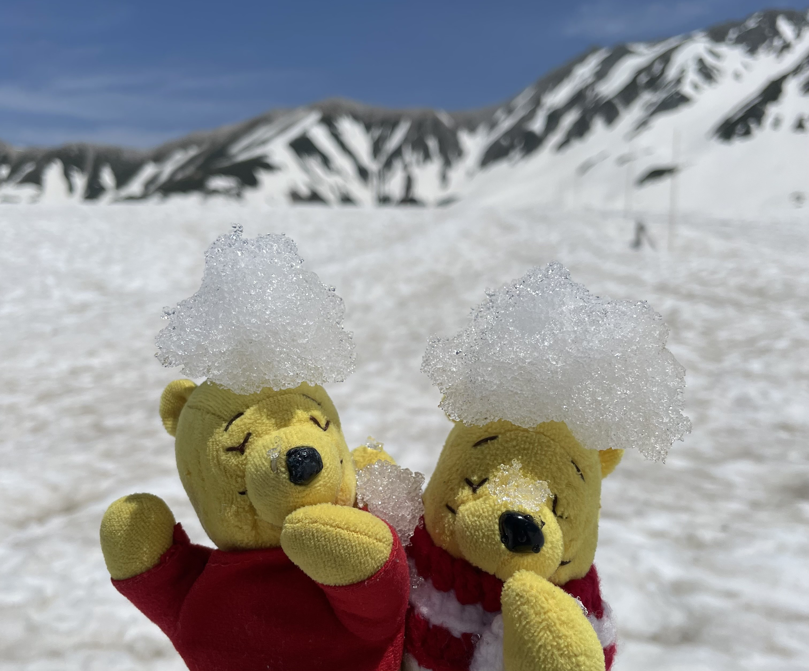 | 
|黑部立山上山口|維尼們與雪山|
| | 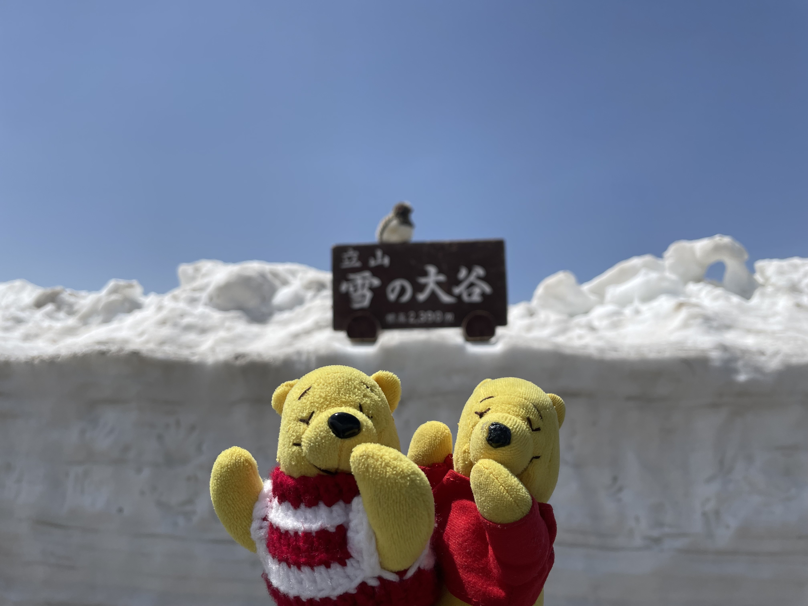 | 
|變成冰中雪人|雪的大谷|
| | 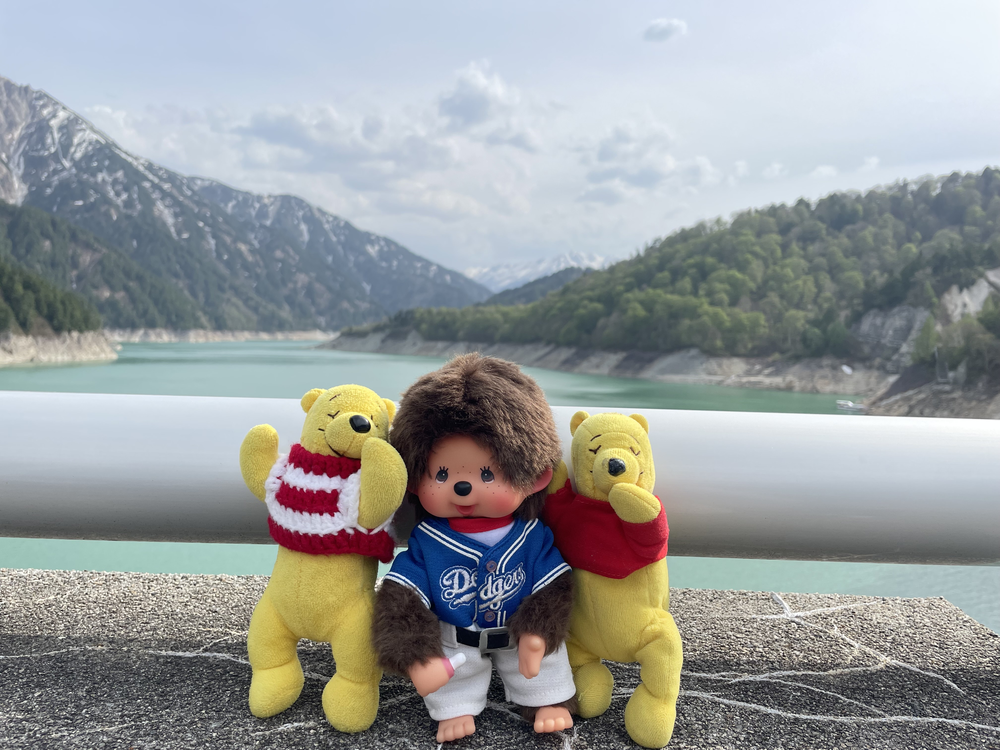 | 
|維尼與雪人|維尼與同團的夥伴|
| | 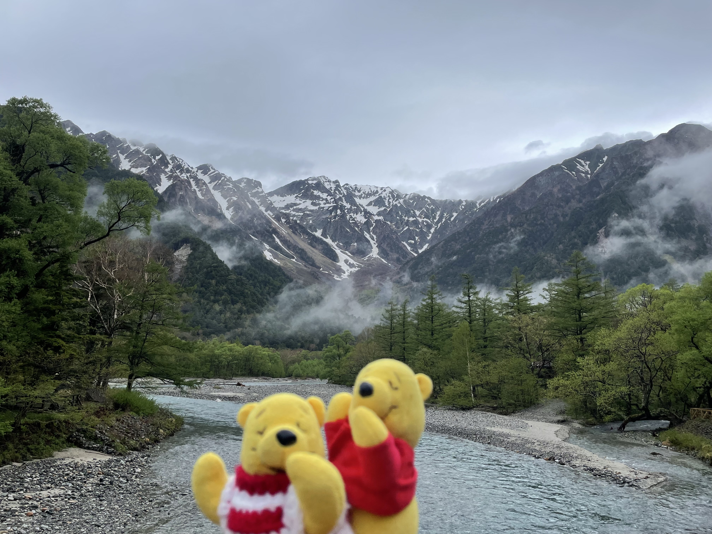 | 
|旅遊團採草莓行程，日本的草莓真的很好吃！|河童橋|

